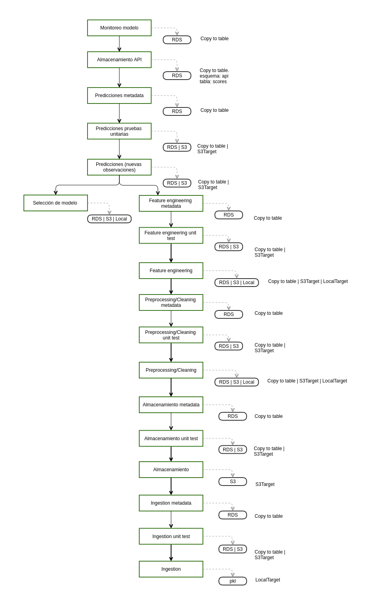
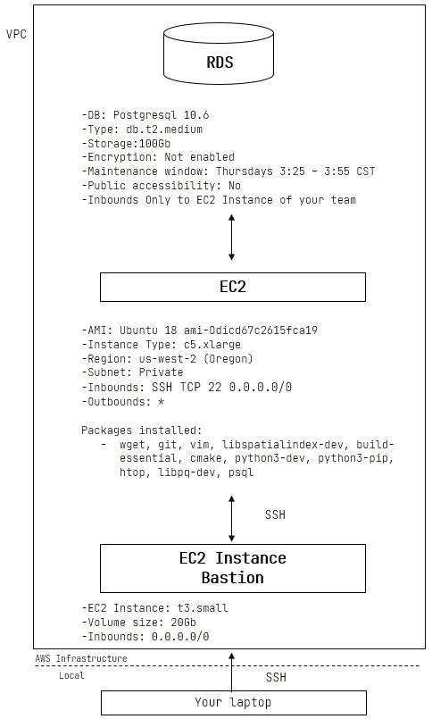
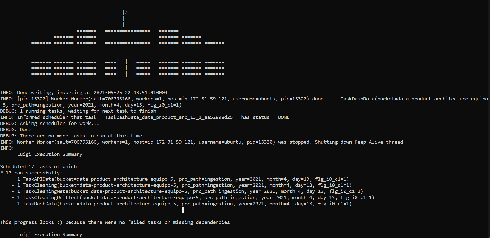
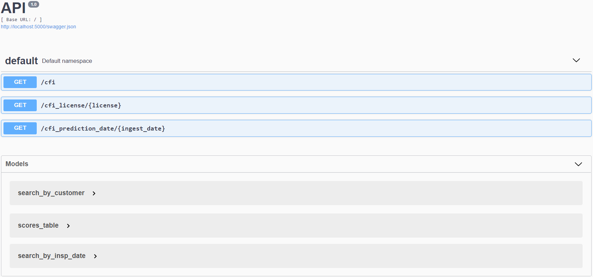
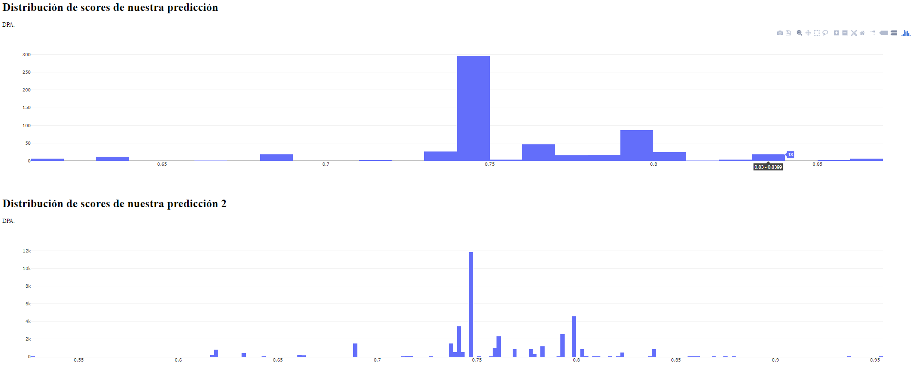

<p align = "center">
    

# <p align = "center"> Maestría en Ciencia de Datos
    
# <p align = "center"> *Data Product Architecture* (Primavera 2021)    
    
---

##

***Contributors***             | ***GitHub's username***
:----------------------------: | :---------------------:
Carlos Román López Sierra      | [Carlosrlpzi](https://github.com/Carlosrlpzi)
José Luis Zárate Cortés        | [jlrzarcor](https://github.com/jlrzarcor)
Octavio Fuentes Ortiz          | [fuentesortiz](https://github.com/fuentesortiz)
Patricia Urriza Arellano       | [patyua](https://github.com/patyua)
Uriel Abraham Rangel Díaz      | [urieluard](https://github.com/urieluard)

---

## Estadísticas del repositorio  :chart_with_upwards_trend:  :chart_with_downwards_trend:

👀  
🌟  
🔌  
👥  

---

**Mediante un algoritmo de clasificación, este proyecto tiene como objetivo ayudar a los establecimientos de comida de la ciudad de Chicago a contestar la pregunta analítica: ¿mi establecimiento pasará o no la inspección?**

**Este producto de datos funciona de forma programática, pues cumpliendo el objetivo planteado, el establecimiento que utilice nuestro modelo, obtendrá una predicción sobre si pasará o no la inspección, para tener oportunidad de tomar acciones preventivas y/o correctivas, en función de la salida que genere el modelo.**

---

## Tabla de contenido  :floppy_disk:

1. [Acerca de este proyecto](https://github.com/jlrzarcor/ITAM-dpa2021#acerca-de-este-proyecto--globe_with_meridians)
2. [Estructura básica del proyecto](https://github.com/jlrzarcor/ITAM-dpa2021#estructura-b%C3%A1sica-del-proyecto--file_folder)
3. [Sobre nuestro *Data Pipeline*](https://github.com/jlrzarcor/ITAM-dpa2021#sobre-nuestro-data-pipeline--microscope)
4. [Sesgos e Inequidades](https://github.com/jlrzarcor/ITAM-dpa2021/blob/main/README.md#sesgos-e-inequidades-open_hands)
5. [¿Cómo ejecutar nuestro *pipeline?*](https://github.com/jlrzarcor/ITAM-dpa2021/blob/main/README.md#c%C3%B3mo-ejecutar-nuestro-pipeline-%EF%B8%8F-)
6. [Consultas a través de nuestra *api*](https://github.com/jlrzarcor/ITAM-dpa2021#consultas-a-trav%C3%A9s-de-nuestra-api-dart)
7. [Monitoreo del modelo](https://github.com/jlrzarcor/ITAM-dpa2021#monitoreo-del-modelo-bar_chart)

---

## Acerca de este proyecto  :globe_with_meridians:


<sup><sub>**NOTA**: Imagen tomada de la página de [***Chicago Data Portal***](https://data.cityofchicago.org/).</sup></sub>

- Trabajamos con la base de datos de [***Chicago Food Inspections***](https://data.cityofchicago.org/Health-Human-Services/Food-Inspections/4ijn-s7e5).

- La información se obtiene de las inspecciones de restaurantes y otros establecimientos de comida en *Chicago* desde el enero de 2010.

- Las inspecciones se realizan por personal del ***Chicago Department of Public Health’s Food Protection Program*** siguiendo un procedimiento estandarizado.

### *Summary* de los datos  :checkered_flag: 


<sup><sub>**NOTA**: Información actualizada hasta el '25/05/2021'.</sup></sub>

##

### ¿Qué buscamos contestar con nuestro modelo? 🧐


##

### Tomar en cuenta :point_left:


##

### ¿Qué lenguaje utlizamos? :pen:


[***Python.org***](https://www.python.org/)

##

[Volver a 'Tabla de Contenido'](https://github.com/jlrzarcor/ITAM-dpa2021/blob/main/README.md#tabla-de-contenido--floppy_disk) 💾 🔘

---

## Estructura básica del proyecto  :file_folder:

```
├── README.md          <- The top-level README for developers using this project.
│
├── conf
│   ├── base           <- Space for shared configurations like parameters.
│   └── local          <- Space for local configurations, usually credentials.
│
├── docs               <- Space for Sphinx documentation.
│
├── notebooks          <- Jupyter notebooks.
│   ├── eda
│   └── feature_engineering
│
├── images             <- Contains images used in the repository.
│
├── references         <- Data dictionaries, manuals, and all other explanatory materials.
│
├── requirements.txt   <- The requirements file.
│
├── .gitignore         <- Avoids uploading data, credentials, outputs, system files etc.
│
├── sql                <- Contains scripts used to deploy RDS db.
│
└── src                <- Source code for use in this project.
    │
    ├── __init__.py    <- Makes src a Python module.
    │
    │
    ├── api            <- Contains Python modules used for app deplyment.
    │
    │
    ├── dashboard      <- Contains Python modules used for dashboard deplyment.
    │
    │
    ├── utils          <- Functions used across the project.
    │
    │
    ├── etl            <- Scripts to transform data from raw to intermediate.
    │
    │
    └── pipeline       <- Functions used for the pipeline.  
```
   
##

[Volver a 'Tabla de Contenido'](https://github.com/jlrzarcor/ITAM-dpa2021/blob/main/README.md#tabla-de-contenido--floppy_disk) 💾 🔘

---

## Sobre nuestro *Data Pipeline*  :microscope:

<p align = "left">
    
    
Nuestro proyecto está conformado por diferentes *tasks*. Para ordenar la secuencia que éstos deben seguir, utilizamos un orquestador llamado [***Luigi***](https://luigi.readthedocs.io/en/stable/).


<sub><sup>**NOTA**: Imagen tomada del [***Luigi's GitHub***](https://github.com/spotify/luigi).</sup></sub>


[***Luigi's documentation***](https://luigi.readthedocs.io/en/stable/)

[***Luigi's GitHub***](https://github.com/spotify/luigi)

### ¿Qué es *Luigi*?


<sub><sup>**Fuente**:[***Luigi's documentation***](https://luigi.readthedocs.io/en/stable/)</sup></sub>

Este orquestador es la herramienta que nos permite correr nuestro *data pipeline*, definiendo aspectos importantes del cómo, cúando y con qué se debe correr cada proceso.

Para administrar el orden de las tareas (cómo nuestros distintos *tasks* correrán) en el *pipeline*, ***Luigi*** utiliza una estructura de datos llamada ***DAG*** (***Directed Acyclic Graph***). Es una herramienta visual útil y que ilustra de manera clara los procesos que nuestro proyecto sigue.

##

La estructura de nuestro *pipeline* es la siguiente:



##

En los **módulos** siguientes se integran las funciones que nos permitirán realizar todo el proceso de *tasks* y *tasks* de *metadata*:

-   

-   

-   

-   

-   

-   

-   
    
-   
    
- 
    
- 

 :open_file_folder: Se encuentran ubicadas en la rama `main` dentro de la carpeta `src` de la siguiente manera:

```
├── src
    │
    ├── etl
    │   ├── task_almacenamiento.py
    │   ├── task_almacenamiento_metadata.py
    │   ├── task_almacenamiento_unit_test.py
    │   ├── task_feature_engineering.py
    │   ├── task_feature_engineering_metadata.py
    │   ├── task_feature_engineering_unit_test.py
    │   ├── task_ingesta.py
    │   ├── task_ingestion_metadata.py
    │   ├── task_ingestion_unit_test.py
    │   ├── task_limpieza.py
    │   ├── task_limpieza_metadata.py
    │   ├── task_limpieza_unit_test.py
    │   ├── task_modelo.py
    │   ├── task_modelo_metadata.py
    │   ├── task_modelo_unit_test.py
    │   ├── task_predicciones.py
    │   ├── task_predicciones_metadata.py
    │   ├── task_predicciones_unit_test.py
    │   ├── task_sesgo_inequidades.py
    │   ├── task_sesgo_inequidades_metadata.py
    │   ├── task_sesgo_inequidades_unit_test.py
    │   ├── task_training.py
    │   ├── task_training_metadata.py
    │   └── task_training_unit_test.py
    │
    ├── pipeline
    │   ├── ingesta_almacenamiento.py
    │   ├── task_api_almacenamiento.py
    │   └── task_monitoreo_modelo.py
```

📂 Los *unit test* que realizamos para probar nuestro *data pipeline* se encuentran ubicadas en la rama `main` dentro de la carpeta `src` de la siguiente manera:

```
├── src
    │
    ├── test
    │   ├── __init__.py
    │   ├── test_almacenamiento.py
    │   ├── test_feature_engineering.py
    │   ├── test_ingestion.py
    │   ├── test_limpieza.py
    │   ├── test_modelo.py
    │   ├── test_predicciones.py
    │   ├── test_sesgo_inequidad.py
    │   └── test_training.py
 ```

##

**Y así se ve el** ***DAG*** **de nuestro** ***data pipeline*** **orquestado en** ***Luigi***:


<sup><sub>**NOTA**: El color verde indica que los *tasks* corrieron de manera exitosa.</sup></sub>

##

[Volver a 'Tabla de Contenido'](https://github.com/jlrzarcor/ITAM-dpa2021/blob/main/README.md#tabla-de-contenido--floppy_disk) 💾 🔘

---

## Sesgos e Inequidades :open_hands:


*Machine Learning* por naturaleza es discriminante, pues lo que hacemos es discriminar datos a través del uso de la estadística. 

Esta discriminación puede ser un problema cuando brinda:
- **Ventajas sistemáticas a grupos privilegiados**.
- **Desventajas sistemáticas a grupos no privilegiados**.

Es de nuestro interés **identificar y cuantificar sesgos e inequidades en diferentes grupos**, para después mitigarlos y cuantificar las consecuencias en las métricas de desempeño *off-line*.

##


<sup><sub>**NOTA**: Imagen tomada del [***Aequitas' GitHub***](https://github.com/dssg/aequitas).</sup></sub>

***Aequitas*** es un ***toolkit open source*** que utilizamos en nuestro proyecto para medir sesgo e inequidad. Fue desarrollado por [***DSSG***](https://www.dssgfellowship.org/).

[***Aequitas project website***](http://www.datasciencepublicpolicy.org/projects/aequitas/)

[***Aequitas' GitHub***](https://github.com/dssg/aequitas)

##


Realizamos dos ejercicios:


- Atributo protegido: `facility_type`.

- Al existir 500 tipos de '*facility_type*', decidimos clasificar los grupos de mayor representación, obteniendo (por orden de mayor a menor representación) las siguientes categorías: 

`restaurant`, `school`, `grocery store`, `children's services facility`, `daycare` y `other`.

<sup><sub>**NOTA**: '***other***' se creó debido a la heterogeneidad de establecimientos que ya no entraban en las categorías previas.</sup></sub>


- Atributo protegido: `zip`.

- Creamos una tabla de códigos postales clasificados por 4 categorías de **tipo de ingreso**:

`high`, `low-mid`, `downtown` y `other`.

<sup><sub>**NOTA**: '***other***' se creó debido a que hay algunos códigos que se encuentran fuera del área de *Chicago* y de los cuales no contamos con su clasificación.</sup></sub>

- Para la creación de estas 4 categorías nos apoyamos en los siguientes 2 mapas:


<sup><sub>**Fuente**: [***Community Areas and Related Zip Codes***](https://www.chicago.gov/content/dam/city/sites/covid/reports/2020-04-24/ChicagoCommunityAreaandZipcodeMap.pdf).</sup></sub>


<sup><sub>**Fuente**: [***Community Areas by Income***](https://voorheescenter.wordpress.com/2015/10/13/the-affordability-challenge-chicago-updates-the-affordable-requirements-ordinance/).</sup></sub>

##


- Grupo de referencia: `restaurant`.

- **¿Por qué?** Porque es la que tiene mayor representación en la base de datos y el objetivo sería que no haya sesgo en las predicciones con etiqueta negativa hacia este tipo de establecimiento.


- Grupo de referencia: `low-mid`.

- **¿Por qué?** Porque el objetivo sería que no haya sesgo en las predicciones con etiqueta negativa hacia este tipo de zonas (con menor ingreso), que pudieran generar mayor disparidad respecto a las demás, tomando en cuenta que la cancelación de licencias de restaurantes puede afectar sensiblemente a la economía o el desarrollo de alguna zona.

##


- Nuestro modelo es `asistivo`.

- **¿Por qué?** De acuerdo a nuestra [pregunta analítica](https://github.com/jlrzarcor/ITAM-dpa2021#qu%C3%A9-buscamos-contestar-con-nuestro-modelo-) y tomando en cuenta que el producto de datos está orientado para que el uso sea por parte de los establecimientos y no por parte del Gobierno de *Chicago*, consideramos que el modelo le permitirá a los dueños de los establecimientos prevenir posibles multas o cancelaciones de licencia por incumplimiento, al momento de realizar consultas sobre si su establecimiento pasaría o no una inspección.

##


- **Interpretación**: la probabilidad de clasificar una inspección como aprobada/fallida dado su `facility_type` o dado su `zip` y que realmente haya sido aprobada/fallida.

- Seleccionamos la métrica porque al ser los negocios los usuarios del modelo, éstos cuentan con recursos limitados (personal, horas laborales, recursos económicos, etc) y queremos asegurarnos que estos recursos no sean utilizados innecesariamente para poner en orden al establecimiento de tal manera que esté listo para aprobar la inspección.


- **Interpretación**: la probabilidad de que hayamos clasificado una inspección como fallida dada su `facility_type` o su `zip` y que la inspección sí haya aprobado.

- Seleccionamos la métrica porque al ser los negocios los usuarios del modelo, nos interesa minimizar los posibles recursos que éstos inviertan en poner al establecimiento listo para la inspección, cuando realmente no sea necesario.

##

[Volver a 'Tabla de Contenido'](https://github.com/jlrzarcor/ITAM-dpa2021/blob/main/README.md#tabla-de-contenido--floppy_disk) 💾 🔘

---

## ¿Cómo ejecutar nuestro *pipeline*? ⚒️ 🚀 


- Se requiere configurar en *AWS* una infraestructura como la mostrada en la imagen siguiente:



<sup><sub>**NOTA**: La configuración de cada instancia, así como de la *RDS* queda fuera del alcance de este *README*.</sup></sub>

- Debido a que utilizamos *RDS* para almacenar tablas de los datos generados en algunos *Tasks*, debemos contar con credenciales que nos permitan entrar a ésta. Para ello, debemos crear un archivo `credentials.yaml` con las claves adecuadas, de tal manera que contenga la siguiente estructura:

```
---
s3:
    aws_access_key_id: "de_tu_cuenta_de_AWS"
    aws_secret_access_key: "de_tu_cuenta_de_AWS"
food_inspections:
    api_token: "de_tu app_token_del_chicago_data_portal"
pg_service:
    user: "tu_postgres_user"
    password: "tu_postgres_user_password"
    host: "direccion_de_tu_RDS.us-west-2.rds.amazonaws.com"
    port: 5432
    dbname: "nombre_base_datos" 
```
    
El cual se debe colocar en la carpeta `conf/local`.

- Crear el archivo de configuración `.pg_service.conf` para el servicio *Postgres*:

```
[alias_servicio]
user=user_rol_postgres
password=password_user_rol
host=end_point_user_RDS
port=5432
dbname=chicagofoodinsp
```

<sup><sub>**NOTA**: *'alias_ servicio'* es el identificador de las credenciales especificadas de servicio.</sup></sub>

El cual se debe colocar en el directorio raíz de la instancia *EC*2:

```
> Directorio del archivo en sistema: ~/.pg_service.conf
```

##

 

1. Tener en ejecución la infraestructura de *AWS*.

2. Abrir su terminal, posicionarse en la carpeta `/home/.ssh` y correr:

```
ssh -i nombre_llave_.pem su_usuario@ec2-direccion-de-la-EC2.us-west-2.compute.amazonaws.com
``` 

para conectarse a la instancia *EC2* (procesamiento).

3. Clonar el repositorio del proyecto: 

`git clone <url del repositorio> <nombre que desea poner al repositorio dentro de su sistema>`.

4. Instalar '*pyenv*' en la instancia de procesamiento y crear un ambiente virtual llamado 'itam_dpa' que tenga : 

`pyenv install 3.7.4`.

5. Activar su ambiente virtual: `pyenv activate itam_dpa`.

6. Instalar '*pip*': `sudo apt install python3-pip`. Asegurarse que el usuario tiene privilegios de *sudo* (*super user*).

7. Instalar nuestro *requirements.txt*: `pip install -r requirements.txt`. 

8. Posicionarse en la carpeta del repositorio clonado en el paso 3.

9. De ser necesario actualizar el repositorio clonado: `git pull`.

10. Declarar las variables de ambiente con los comandos:

```
export PGSERVICEFILE=${HOME}/.pg_service.conf
export PGSERVICE=nombre_de_tu_service
export PYTHONPATH=$PWD
```

11. De igual manera, es necesario crear la infraestructura de tablas en `psql` para almacenar la metadata. Para lo anterior, debe tener acceso a la *RDS* como usuario `postgres`. Posicionarse en la carpeta `/sql` y correr los siguientes comandos:

```
psql -f create_api_tables.sql
psql -f create_db.sql
psql -f create_schemas.sql
psql -f create_metadata_tables.sql
psql -f create_procdata_tables.sql
```

12. A partir de este punto ya se ejecutan los *tasks* de *Luigi*: 

```
PYTHONPATH="." luigi --module 'src.pipeline.task_monitoreo_modelo' TaskDashData --bucket nombre_de_tu_bucket --year año_deseado --month mes_deseado --day dia_deseado --flg-i0-c1 1
```
    
:rotating_light: **NOTA**: Este comando  :point_up_2: ejecuta todos los *tasks* de nuestro *pipeline*. :rotating_light:
    
Tomar en cuenta:

:warning: Tanto los meses como los días, no llevan un cero antes.

:warning: Después del *flag* `--flg-i0-c1` se puede escribir 0 (ingesta inicial) ó 1 (ingesta consecutiva).

:warning: `prc-path` es la ruta de la subcarpeta que almacena el proceso. Por *default* nosotros lo llamamos `ingestion`.

:warning: Para probar el *unit test* de este *Task* y que marque un error, se debe indicar un valor entre 0 y 100 después del *flag* `--avg-prec` que sea mayor al promedio de la precisión por grupo que se reporte en la tabla de métricas (en general valores mayores 95 funcionan bien).

- Si el *task* corrió de manera exitosa, el siguiente mensaje es desplegado:



##

[Volver a 'Tabla de Contenido'](https://github.com/jlrzarcor/ITAM-dpa2021/blob/main/README.md#tabla-de-contenido--floppy_disk) 💾 🔘

---
 
## Consultas a través de nuestra *api* :dart:
    

    
    
    
[***Flask documentation***](https://flask.palletsprojects.com/en/2.0.x/)
    
Para hacer consultas de nuestro modelo predictivo, creamos una *api* utilizando *Flask*.
    
    
    
13. Posicionarse en la ruta: `src/api`.
    
14. Correr el comando: `export FLASK_APP=flask_cfi.py`.
    
15. Correr el comando: `flask run --host=0.0.0.0`.
    
16. En una terminal local, posicionarse en `.ssh` y correr el comando: `ssh -o ServerAliveInterval=60 -i id_rsa -N -f -L localhost:5000:localhost:5000 nombre_usuario@ec2-direccion_instancia.us-west-2.compute.amazonaws.com`.
    
Después abrir el *browser* de tu preferencia e ingresar a la siguiente dirección: `localhost:5000/`.
    
Una vez hecho lo anterior, la *api* se verá de la siguiente manera:
    

    
La *api* cuenta con 2 *endpoints*:
    
- `cfi_license` : Devuelve las predicciones del número de licencia del establecimiento consultado. 
    
- `cfi_prediction_date` : Devuelve las predicciones realizadas en la fecha consultada.
    
---    
      
##  Monitoreo del modelo :bar_chart:
 
    
    

    
[***Plotly documentation***](https://plotly.com/)    
    
    
    
[***Dash documentation***](https://flask.palletsprojects.com/en/2.0.x/)    
    

    
Para realizar el monitoreo de nuestro modelo, construimos un *dashboard* utilizando *Dash* de *Plotly*.
    

    
17. Posicionarse en la ruta: `src/dashboard`.
    
18. Correr el comando: `python3 app.py`.
    
19. En una terminal local, posicionarse en `.ssh` y correr el comando: `ssh -o ServerAliveInterval=60 -i id_rsa -N -f -L localhost:8050:localhost:8050 nombre_usuario@ec2-direccion_instancia.us-west-2.compute.amazonaws.com`. 
    
Después abrir el *browser* de tu preferencia e ingresar a la siguiente dirección: `localhost:8050/`.
    
Una vez hecho lo anterior, el *dashboard* se verá de la siguiente manera:
    
    
    
---  
